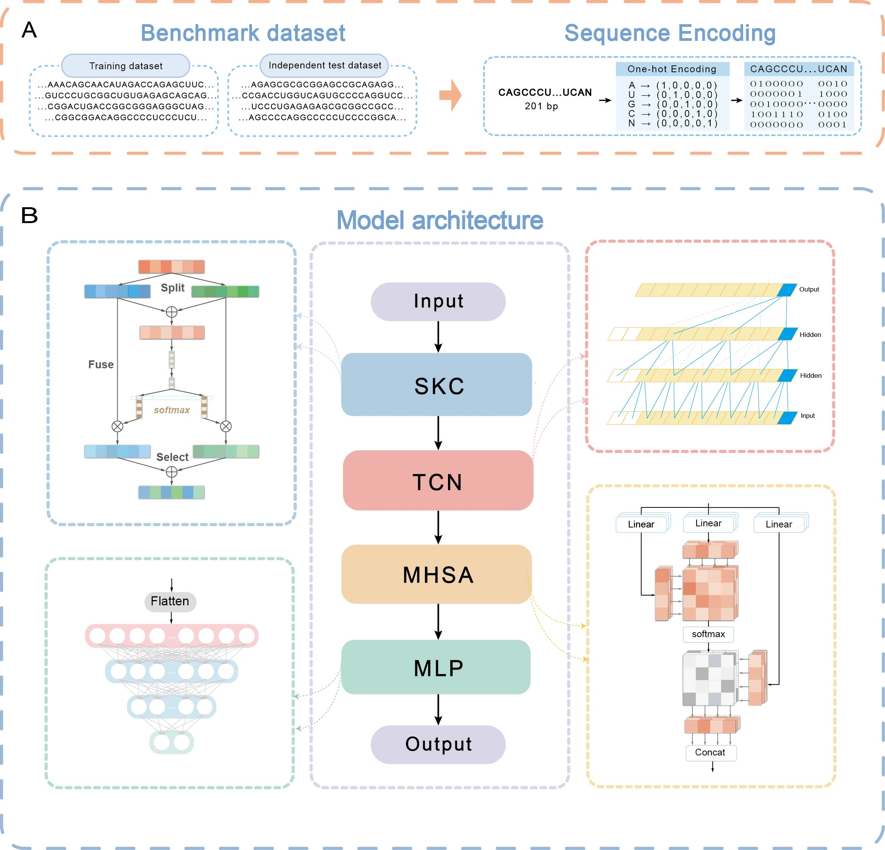

# STM-ac4C: A PyTorch Model for Predicting ac4C Sites in Human mRNA

STM-ac4C is a deep learning model that can predict the ac4C sites in human mRNA sequences. ac4C is a modified nucleoside that plays an important role in regulating gene expression and protein synthesis. The accurate prediction of ac4C sites can help to understand the biological functions and mechanisms of ac4C modification.

## Model Architecture

STM-ac4C is a hybrid neural network that combines selective kernel convolution, temporal convolution network, and multi-head self-attention mechanism, which can effectively capture the different patterns, structures, and correlations in RNA sequences, thereby improving the prediction accuracy and robustness. Selective kernel convolution(SKC) adaptively captures k-mer features of different lengths, avoiding the limitation of fixed kernel size. The temporal convolution network(TCN) has a more vigoroso long-term dependency modeling ability than LSTM and can better handle the temporality and dynamics of RNA sequences. On the other hand, the multi-head self-attention(MHSA) mechanism can enhance the representation ability of the model and capture the global and local correlations in RNA sequences. Finally, MLP will serve as the classifier's last layer and transform the previous layer's output into the prediction result through nonlinear activation functions and fully connected layers.



## Project Structure

The project contains the following folders and files:

- data: This folder contains the ac4C dataset used (training dataset and independent test dataset) from iRNA-ac4C
- models: This folder contains the py file of the STM-ac4C model.
- save_ckpt: This folder contains the checkpoint files of the trained model.
- utils: This folder contains some functions and methods that are used for data processing, training, and prediction.
- code.ipynb: This file is a Jupyter notebook that shows how to use the STM-ac4C model for prediction. It provides some examples and explanations of the model functions.

## Requirements

To use this project, you need to install the following libraries:

- torch                     2.0.0+cu118
- pandas                    2.1.1                   
- pytorch-lightning         2.0.8                    
- pytorch-metric-learning   1.7.3 
- pandas                    2.1.1
- multimethod               1.9.1

You can install them by running the following command:

```bash
pip install -r requirements.txt
```

## Usage

To use the STM-ac4C model for prediction, you need to follow these steps:

1. Import the classifier and the utils from the project folder.

```python
from models.SK_TCN_MHSA import classifier
from utils.one_trial import LitModel
from utils.prepare_data import get_ac4C
```

2. Get the ac4C data as trainset and testset.

```python
trainset, testset = get_ac4C()
```

3. Get the hyperparameters and the model parameters of the classifier.

```python
hparams = classifier.get_hparams()
model_params = classifier.get_model_params()
```

4. Create a LitModel instance with the classifier, the hyperparameters, and the model parameters.

```python
model = LitModel(classifier, hparams , model_params)
```

5. Use the `test` function to perform prediction and evaluation on the testset. You need to specify the checkpoint path of the trained model.

```python
model.test(testset, ckpt_path="save_ckpt/mcc0.6958.ckpt")
```

6. Use the `predict_proba` function to get the probability of each sample containing an ac4C site. You need to specify the checkpoint path of the trained model.

```python
proba = model.predict_proba(testset, ckpt_path="save_ckpt/mcc0.6958.ckpt")
```

7. Use the `fit` function to train the model on the trainset.

```python
model.fit(trainset)
```
